# Safe Menu

> 本地路径：`http://localhost:6800/#/safe-menu`


## 背景

不知你是否遇到过这种场景：将鼠标悬停在一个菜单项时，该菜单项会显示另一个子菜单项（即嵌套菜单）。但当你试图将鼠标移入子菜单时，结果整个菜单都关闭了，十分令人恼火。

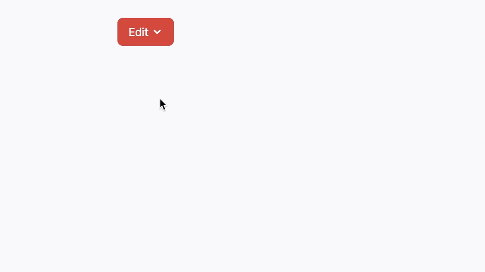

在“安全三角”概念出现前，最常见的做法就是给子菜单添加一个延时，但它也存在诸多问题，比如在鼠标移动时响应不够迅速，会出现残影。

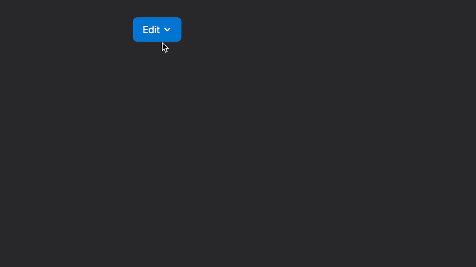

> **延迟时间**
>
> 最大问题：每个人的鼠标移速都不一样，设置多少 ms 合适？设置小了，来不及，设置大了，反应迟钝。这个问题在一级菜单项少，二级菜单项超多时会更突出。通过鼠标直接移动到二级菜单最底部，和靠近一级菜单的位置时，距离产生的时间差会更明显。

## Safe Triangle

如果它是你一直在努力应对的用户体验挑战，那么一个名为“安全三角”（safe triangle）的概念则解决了这个问题。这并不是一个新想法，早在 10 年前，亚马逊（Amazon）就在电商网站的大型下拉菜单上普及了它，Ben Kamens 曾写过一篇文章 [Breaking down Amazon’s mega dropdown](https://bjk5.com/post/44698559168/breaking-down-amazons-mega-dropdown)，对其进行剖析。在那个年代，就像是黑魔法一样，因为它比使用延时策略反应要快上许多。

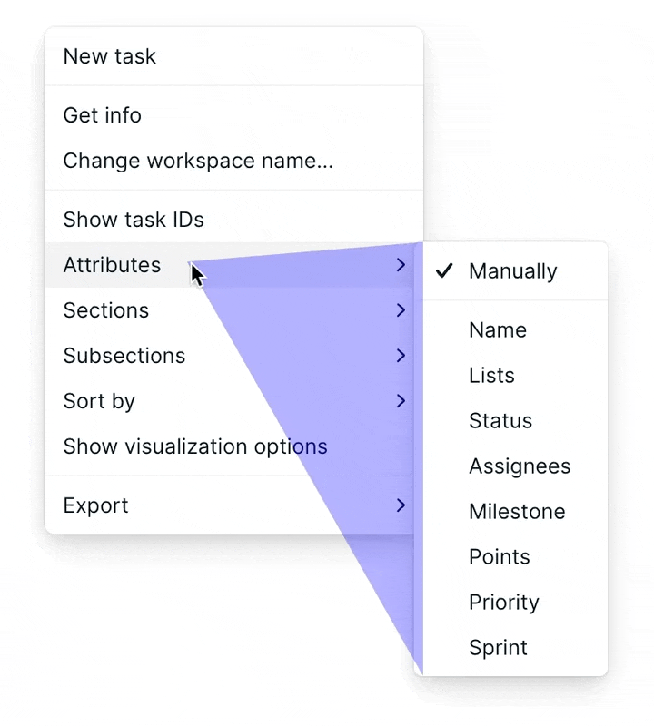

### 亚马逊菜单 vs 延时菜单

亚马逊下拉菜单快速切换

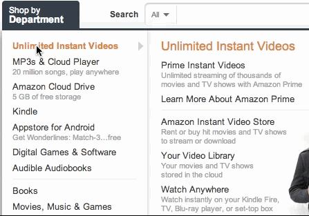

加入延时的普通下拉菜单，显示则要慢上许多


### 亚马逊方案

光标从亚马逊的主下拉菜单移动到子菜单很容易，并且在菜单切换时也十分丝滑，毫无延时。其秘诀就是通过检测光标路径位置，当前鼠标位置与下拉菜单的右上角和右下角之间绘制一个三角区域。下一刻当鼠标从此区域（图中蓝色区域）快速划过，则会使子菜单继续保持打开状态。一旦离开此区域，则会立即切换菜单，给人灵敏的感感。

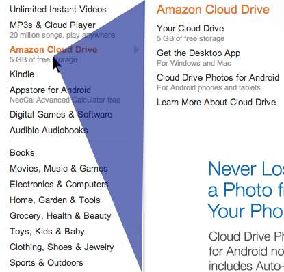

*光标移动到蓝色区域中，当前显示的子菜单将保持打开状态一段时间*{.woap-alt}

### jQuery 插件

[jQuery-menu-aim](https://github.com/kamens/jQuery-menu-aim) 是一个用于下拉菜单的 jQuery 插件，可以区分用户尝试将鼠标悬停在下拉菜单项上还是尝试导航到子菜单的内容。上下导航菜单时也可以更快的转换，达到与亚马逊下拉菜单类似的效果。

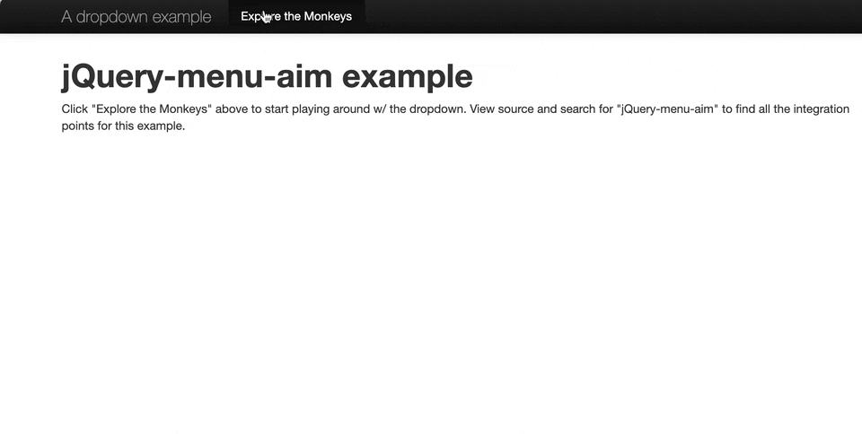

代码示例：

```js
 $("#menu").menuAim({
     activate: $.noop,  // 行激活时触发
     deactivate: $.noop  // 行停用时触发
 });
```

## 应用案例

正是因为它的良好交互体验，所以在很多地方都能看到它的身影。比如 Notion 菜单、Web 版 VS Code 菜单、还有 macOS 的系统菜单等等。

### Notion

Notion 在 2023.02.25 发帖表示：现在菜单交互更加流畅，不再因光标精度问题而意外消失。

> A li’l quality-of-life update:
>
> Before, you had to be really precise with your cursor so menus wouldn’t disappear on you. Should feel much more polished now 🫡

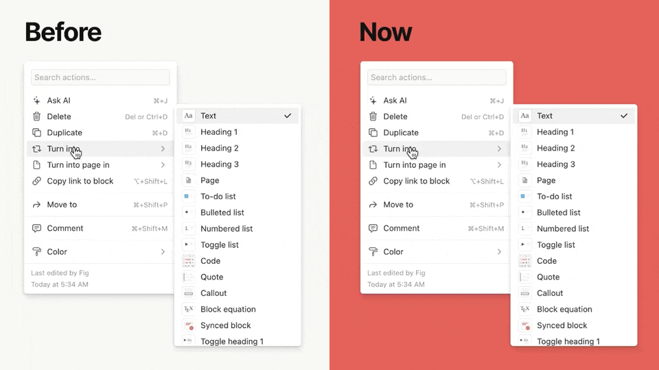

### VS Code

打开 GitHub 的 VS Code 编辑器（在任意 github 仓库下，按下 `.` 键即可快速进入编辑器模式），会发现其菜单也使用了类似实现。

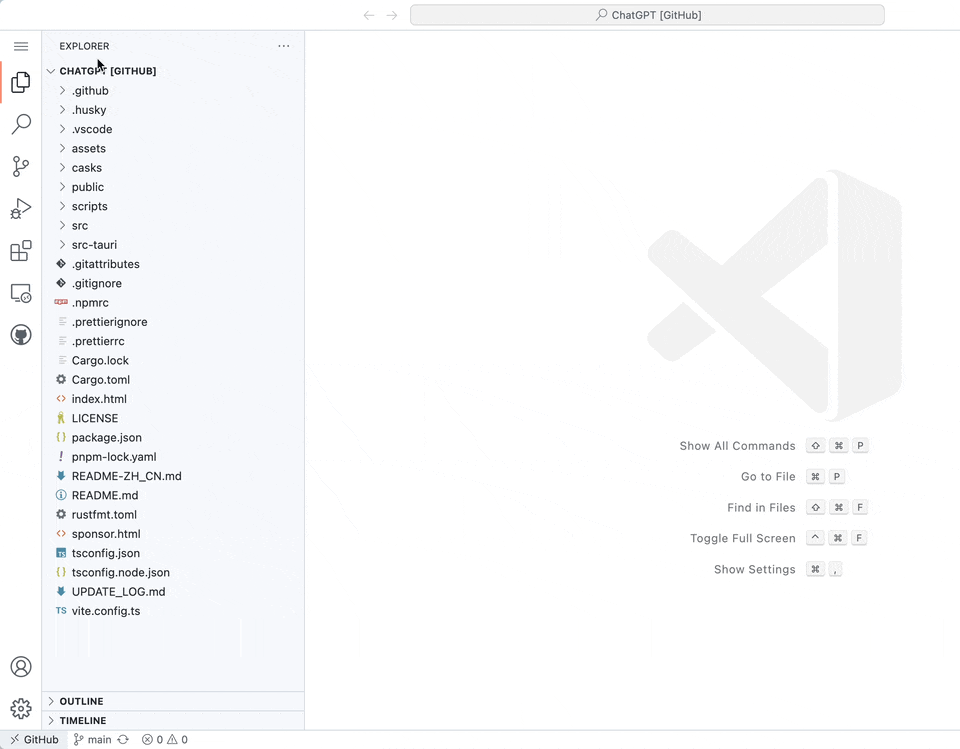

### macOS

macOS 一直以注重用户细节而闻名，当然在菜单上也不会例外。

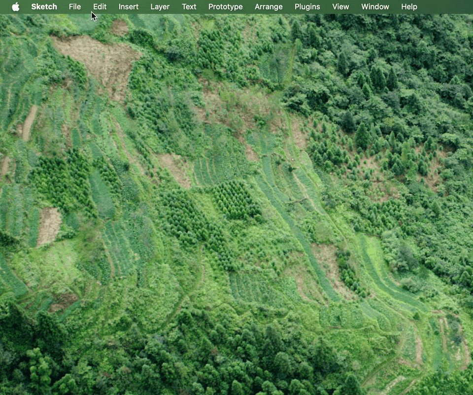

## 开源组件

这里介绍两个开源组件库 Antd 和 Radix，不幸的是 Antd 并未实现此功能。

### Antd

阿里开源的 [Antd](https://github.com/ant-design/ant-design) 算是在 React 生态下最大的组件库之一了，当前最新版为 `v5.9.4`。可以从以下演示中看出，下拉菜单并未实现此优化。

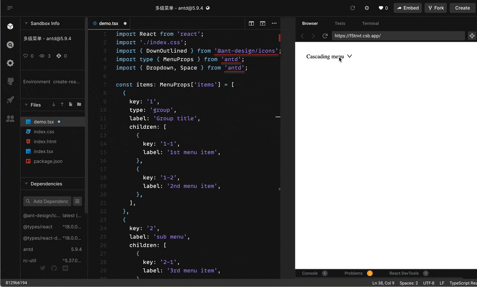

### Radix

[Radix](https://github.com/radix-ui/primitives) 下拉菜单已实现此优化。

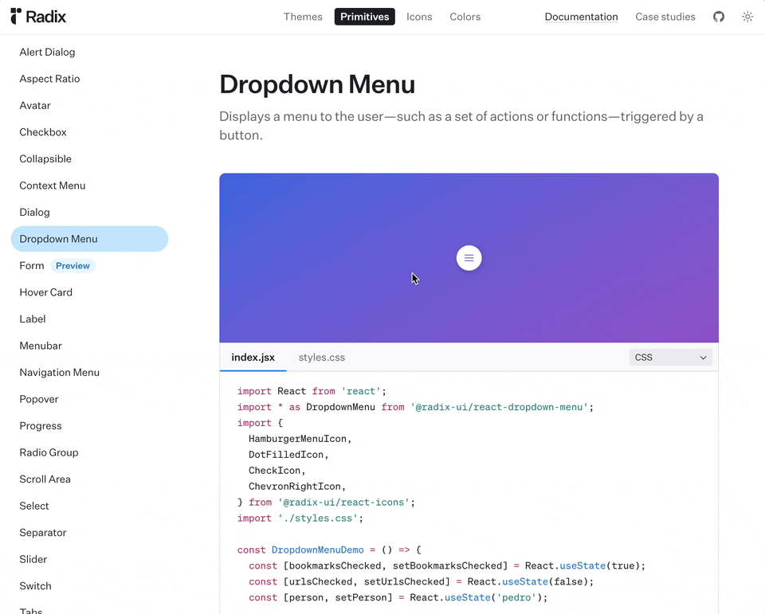

## 实现原理

这种方法的两个关键要素是使用 `SVG` 和 CSS `pointer-events` 属性来创建一个所谓的“安全区域”（safe area）或“安全三角”（safe triangle），目的是为了防止用户在尝试导航到子菜单时意外关闭它。基本思路和实现步骤如下：

### Step 1

> 鼠标悬停（Mouse Enter and Leave）

鼠标悬停在包含嵌套元素的菜单项（组件 SafeAreaOption）上时，触发一个 `onMouseEnter` 回调来打开嵌套菜单。当鼠标离开元素及其子元素时，`onMouseLeave` 回调负责关闭子菜单。

```tsx
const SafeAreaOption = () => {
  const [open, setOpen] = useState(false);
  const parent = useRef<HTMLLIElement | null>(null);
  const child = useRef<HTMLDivElement | null>(null);

  const getTop = useMemo(() => {
    const height = child.current?.offsetHeight;
    return height ? `-${height / 2 - 15}px` : 0;
  }, [child]);

  return (
    <li
      ref={parent}
      className="relative"
      onMouseEnter={() => setOpen(true)}
      onMouseLeave={() => setOpen(false)}
    >
      <MenuPlaceholder />

      {open && parent.current && child.current && (
        <SafeArea anchor={parent.current} submenu={child.current} />
      )}

      <div
        className="absolute"
        style={{
          visibility: open ? 'visible' : 'hidden',
          left: parent.current?.offsetWidth || 0,
          top: getTop,
        }}
        ref={child}
      >
        <ul>
          {Array.from({ length: 6 }).map((_, idx) => <li key={+idx}>Option {idx + 1}</li>)}
        </ul>
      </div>
    </li>
  );
};
```

### Step 2

> 绘制 SVG

使用 SVG 绘制安全三角形（组件 SafeArea）。当嵌套菜单打开时，将 SVG 创建为不可见但存在的子元素，与用户进行交互（无意识）。需要确保 SVG 是矩形，其高度等于嵌套菜单的高度，宽度等于光标与嵌套菜单之间的距离。只要鼠标悬停在 SVG 元素上，我们就可以使用某些东西来维护嵌套菜单的打开状态。

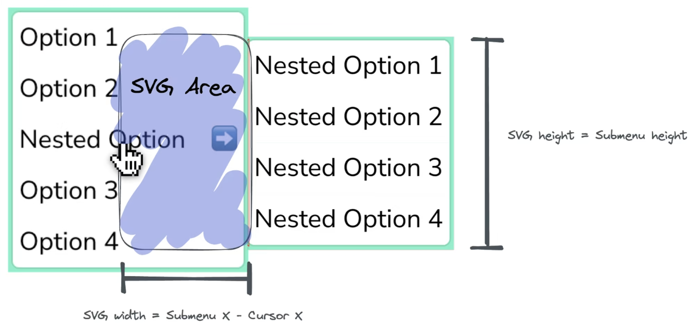

> 指针事件（Pointer Events）

创建一个预期路径（通常是三角形）来连接用户的光标和子菜单，只要光标位于 SVG 元素上就保持子菜单的打开状态。

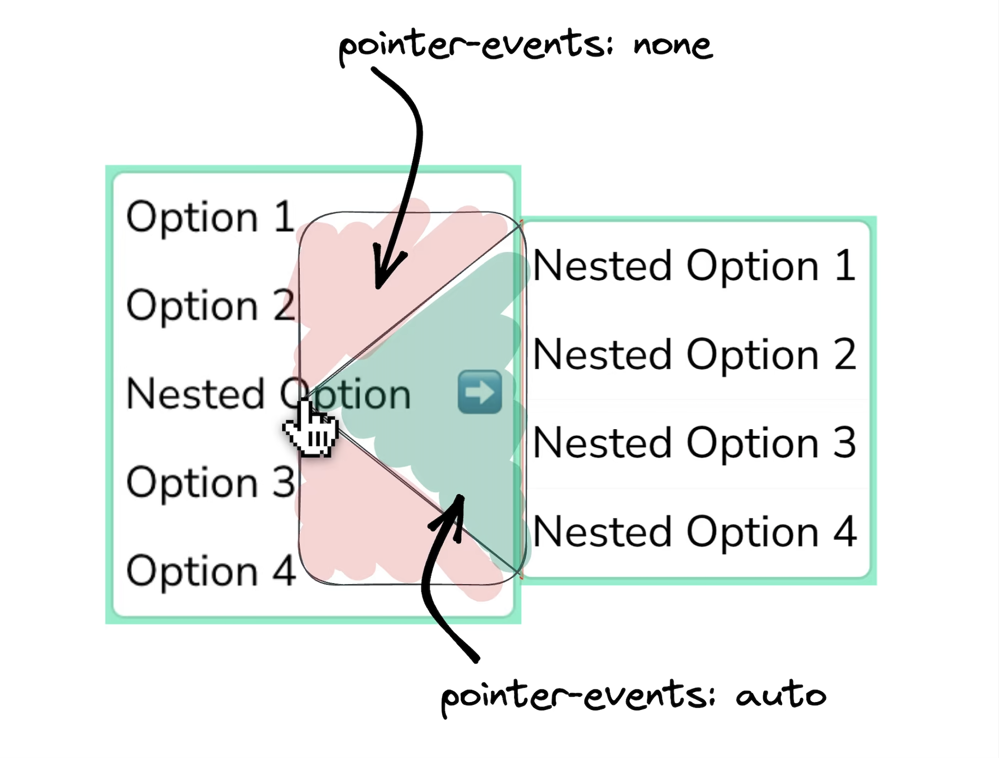

> 安全三角（Safe Triangle）

三角形是 SVG 的唯一路径元素，必须设置 CSS 的 `pointer-events` 属性为 none，并且在路径元素中设置 `pointer-events` 为 auto。这样做是为了在事件来自路径元素“安全三角形”时阻止传播事件，而当事件来自 SVG 的其他区域时不阻止。

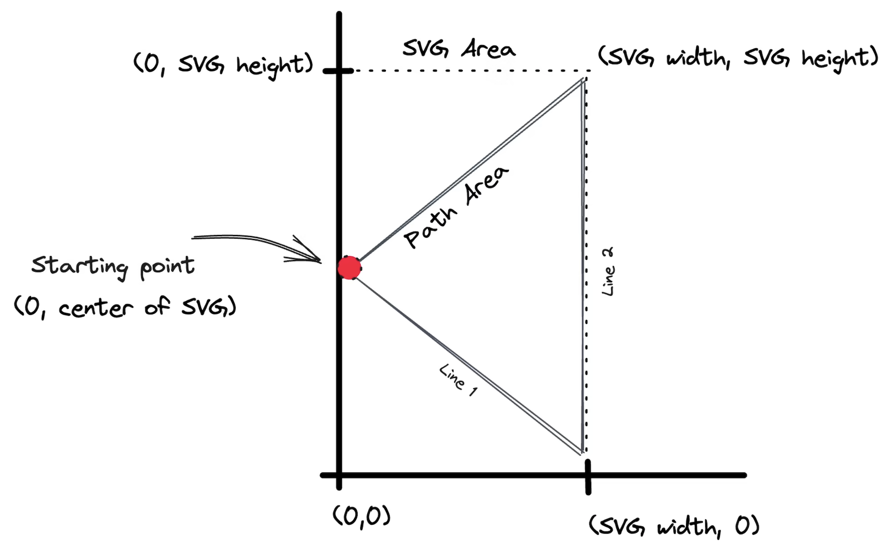

```tsx
import useMousePosition from './useMousePosition';

interface SafeAreaProps {
  anchor: HTMLLIElement;
  submenu: HTMLDivElement;
}

export default function SafeArea({ submenu }: SafeAreaProps) {
  const { x: mouseX, y: mouseY } = useMousePosition();

  const {
    // width: submenuWidth,
    height: submenuHeight,
    x: submenuX,
    y: submenuY
  } = submenu.getBoundingClientRect();

  const svgWidth = submenuX - mouseX + 4;
  const svgHeight = submenuHeight;

  return (
    <svg
      style={{
        position: 'fixed',
        width: svgWidth,
        height: submenuHeight,
        pointerEvents: 'none',
        zIndex: 2,
        top: submenuY,
        left: mouseX - 2
      }}
      id="svg-safe-area"
    >
      {/* 矩形区域 */}
      <path
        pointerEvents="none"
        width="100%"
        height="100%"
        fill="rgba(187,39,38,0.05)"
        d={`M 0,0 L ${svgWidth},0 L ${svgWidth},${svgHeight} L 0,${svgHeight} z`}
      />
      {/* 三角安全区域 */}
      <path
        pointerEvents="auto"
        stroke="red"
        strokeWidth="0.4"
        fill="rgba(114,140,89,0.3)"
        d={`M 0, ${mouseY-submenuY}
          L ${svgWidth},${svgHeight}
          L ${svgWidth},0 z`}
      />
    </svg>
  );
}
```

```tsx
/**
 * ❤️ From:
 * https://www.joshwcomeau.com/snippets/react-hooks/use-mouse-position/
 *
 */
import { useState, useEffect } from 'react';

export default function useMousePosition() {
  const [mousePosition, setMousePosition] = useState({ x: 0, y: 0 });

  useEffect(() => {
    const updateMousePosition = (ev: MouseEvent) => {
      setMousePosition({ x: ev.clientX, y: ev.clientY });
    };
    window.addEventListener("mousemove", updateMousePosition);

    return () => {
      window.removeEventListener("mousemove", updateMousePosition);
    };
  }, []);

  return mousePosition;
}
```

文中展示的代码示例过于简单，并不足以解决所有问题，例如当用户鼠标斜向移动触摸到另一个菜单项的问题，可能需要对 SVG 进行不同形状的调整。经测试，弯曲的路径往往能够获得更好的用户体验。所以创建一个依赖于鼠标悬停来显示嵌套菜单的解决方案远比想象中要复杂。


完整代码已整理到 [lencx/fe-tips](https://github.com/lencx/fe-tips) 仓库，可自行获取代码。

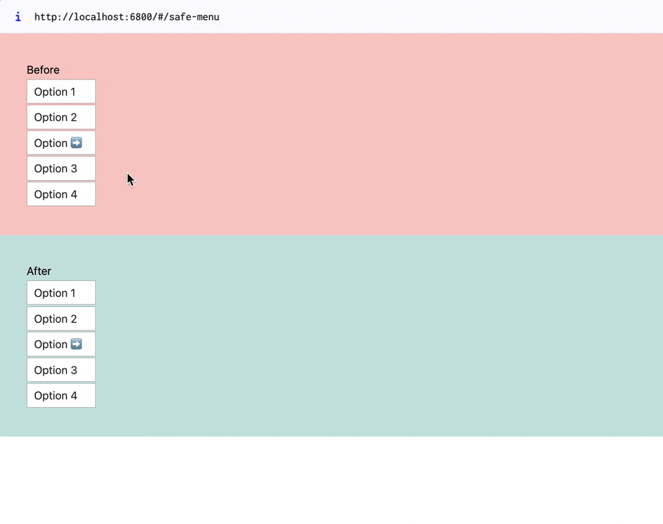

> 参考链接：
> Better Context Menus With Safe Triangles: https://www.smashingmagazine.com/2023/08/better-context-menus-safe-triangles